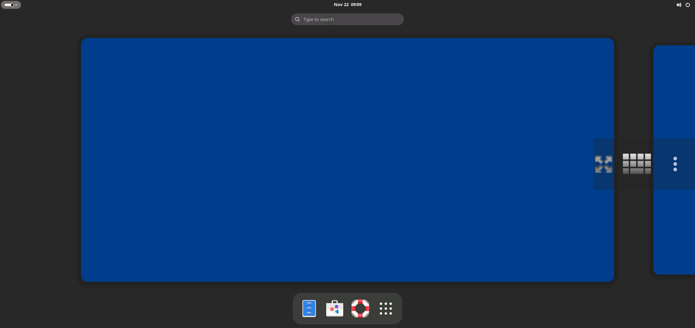

<center></center>
<p align="center"><b>Easily Install Gnome Desktop in Termux</b></p>

<div align="center">

[](https://github.com/sabamdarif/modded-kali/stargazers)
[](https://github.com/sabamdarif/modded-kali/issues)

</div>

### Features:

- :speaker: Fixed Audio Output
- :globe_with_meridians: 2 Browsers (Chromium & Mozilla Firefox)
- :tv: VLC Media Player work fine
- :books: Easy To Setup
- :computer: Vnc Login Issue Fixed
- :hammer: Gnome Software Preinstalled (working)
- :books: And Much More

### Installation:
1. If you are using android 12 or higher then first disable phantom process killer [Tutorial](https://termux.xyz/how-to-fix-termux-error-process-completed-signal-9-press-enter/)
2. Install [Termux](https://termux.com) apk from [HERE](https://f-droid.org/repo/com.termux_118.apk)
3. Secondly Install Any Debian Based Proot-distro & pulseaudio For Audio Working

   - `pkg update -y ; pkg install proot-distro pulseaudio -y`
   - `proot-distro install DISTRO-NAME`
   - `proot-distro login DISTRO-NAME`
   - Now copy pest this in the distro 👇
  
4. 
   ```
   apt update -y ; apt install wget -y ; wget https://raw.githubusercontent.com/sabamdarif/gnome-in-termux/main/install-gnome-desktop ; chmod +x install-gnome-desktop ; ./install-gnome-desktop 
    ```
   - Now Select **CORE** Or **FULL** Which You Want
       <details>
       <summary><b><code>DEMO IMAGES: </code></b></summary>

       |CORE|FULL|
       |--|--|
       |||
      </details>

5. **You have to note your VNC password !!**
6. **Now Restart Termux And Login Into Your Distro**
7. Install VNC VIEWER [Google Play Store](https://play.google.com/store/apps/details?id=com.realvnc.viewer.android&hl=en)
Or NetHunter KeX from [Nethunter Store](https://store.nethunter.com/en/packages/com.offsec.nethunter.kex/)
8. Click on Connect & Input the Password
9. Enjoy :smile:

### NOTE:

- **Type `DISTRO-NAME` to login into DISTRO CLI.**
- **Type `vncstart` to run Vncserver**
- **Type `vncstop` to stop Vncserver**
- **Type `vncstop -f` to stop Vncserver forcefully**

### Warning: 
- *In future if you upgarde the system the desktop will fail to launch.*
## FIX:
- **First run the below command then login again**
```
for file in $(find /usr -type f -iname "*login1*"); do rm -rf $file
   done
```

### ISSUES:
- **1:-** *Debian Based Distro Supported Only*

### If you like our work then dont forget to give a Star :)

